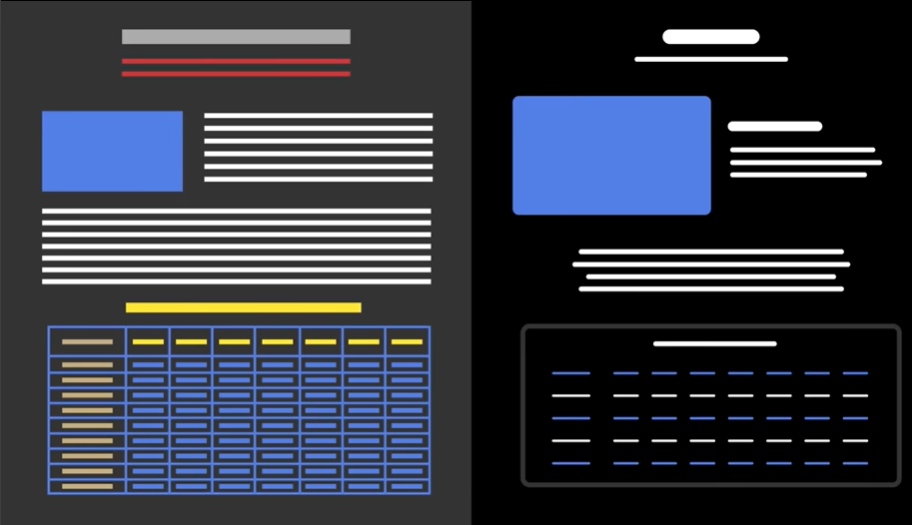

# Designing Principles

# https://youtu.be/qyomWr_C_jA?si=47mGktjFgD97Sbr1

**Key Design Principles and practical tips to create top tier websites.**

Creativity is a process “To Connect Ideas”

To make a good design, Combine what’s already present but in a unique way. 

### Rule 1: Good design is as little design as possible.

- focus on essential features and make them better and useful for users.
- It also means - less colors, words and clutter on the screen.
    
    
    
- Instead of starting with header and going down, or planning the whole design…
Ask what are the key functionalites or main selling points of website, and start from there. [could be heading, input field and button]
    
    **Design as little as possible to avoid adding too many unnecessary elements to frustrate users and it looks ugly.**
    
    easy to build and easy to use for users.
    

### Rule 2: Law of Similarity and Proximity to simplify the design


- Shapes, Size, Color and spaceing to Group Elements

Gestalt Theory: The whole of something is greater than it’s parts.

The mind percieves - patterns as whole, rather than just individual elements.

- Design Should be Scannable within seconds.

Law of similarity makes the design better and consistent. This is easier to design.
Law of proximity makes the layout and placing better.


### Rule 3: Elements need more spacing than you think

1. Start with a lot of spaceing and look at the design as a whole.
2. Then reduce the spacing until it looks fine.

### Rule 4: Use a design system

For a simple website, define a key design elements.


1. **Spacing:**
    
    Use values which are divisible by 4. (e.g. 4, 8, 12, 16, 20…)
    
    - Using Lorem texts is not ideal as spacing may vary with the length of texts.
    - use larger values first then reduce it to which fits.
    - Use `rem` units for font size and margin, so the design can adapt to the user system preference. 
    1rem = 16px
2. **Fonts and Colors**
    - Pick few values and assign them as global variable.
    - There is no real science behind choosing colors.
    - Pick a dark color, light color and two more for personality.
    - Avoid text aligned to center, especially for paragraphs and small texts.
    - Line height is inversely proportional to text size.
    Smaller texts needs greater line height for better legibility. It also acts as margin tops.
3. **Design Key elements**
with colors. One with primary accent and another with secondary accent.

Web design is about putting right element at the right place with the right sizing.

### Rule 5: Hierarchy is everything

To emphasis important elements - we can use size, weight and colors.

Start small as even little changes can make a big impact on the overall design.

- Ask first: What’s the first thing a user will look for in the video?
It’s the title, so emphasis it.
1. Sometimes to emphasize something, you need to de-emphasize the other elements.
2. You can increase the font weight for more emphasis
3. You can increase the font size too for more emphasis

User will scan and look for key information to focus on, so design needs to be scannable. Emphasize the label, values or icons depending on the context.

- Introduce depth to add some character.
    - Use colors and shadows to elevate important elements.
    - Shadows can replace solid borders
        - Lighter color or Bigger Shadow = More Elevation
        - Darker color or Inner Shadow = More Depth
    - Use accent colors to highlight important elements.
    - Replace solid color with a subtle gradient.
    - Experiment with tables and cards to make them more exciting and fun.

## The Creative Process

### Step 1: Learn the basics

books: Atomic design by brad frost

### Step 2: Find a source of inspiration

study the styles of top tier websites or works on figma community.

### Step 3: Brainstorm some ideas

### Step 4: Step away from the problem and do something else

### Step 5: Don’t fall in love with your idea

test with users and improvise with the feedbacks.

# https://youtu.be/-uyI0TjhXdk?si=_lrmkokAHsmQHDJo

Whether you are building a simple static site or a dynamic app, using reuseable parts keeps the code cleaner and easier to maintain.

Design system is basically a collection of reusable UI components, global CSS styles and utility classes. 

Create pre-defined reusable components and speed up the development.

### Step 0: Design first, build later

### Step 1: Design your components

### Step 2: Setup the CSS variables

```css
/* Reset */
* {
margin: 0;
padding: 0;
box-sizing: border-box;
}
/* declaring variables in :root **for maintaining consistency** */
:root {
	--color10: hsl(31, 80%, 10%);
	--color30: hsl(31, 80%, 30%);
	--color90: hsl(31, 80%, 90%);
	--color100: hsl(31, 80%, 100%);
	--accent: hsl(31, 80%, 70%);
  --ff : "Noto Sans JP", serif;
  --ff : "Fira Sans", serif;
  --p: 1rem/1.5rem var(--ff);
  --h1: 600 3rem/1.2rem var(--ff2);
  --h2: 600 3rem/1.2rem var(--ff2);
  --spacing1: 4px;
  --spacing2: 8px;
  --spacing3: 16px;
}
```

### Step 3: Create global styles

```css
/* Global Styles */
html {
scroll-behavior : smooth;
}
body{
text-wrap:balance;
}
/* more examples of styling for creating a organized system */
```

- Always use defined variables instead of fixed values.
- Start with the basics, more styles can be added later as needed.
- Setup theme colors and typography in no-code platforms

### Step 4: Create utility classes

Things like sections, layouts, paddings, text-alignment and margin helpers.

There are two main approaches to writing CSS

1. Single file approach: everything in one CSS file.
2. Component Based approach: breaking things into separate CSS files for different components.

### Step 5: Create and Style your components

( web component + vanilla css / svelte + vanilla css / svelte + tailwind ) 

- Create Header once and reuse it as it will be same across the website.
- Create utility classes and use them across multiple sections among multiple pages. Same goes for CTA

**Native way of creating components**


use it like 

```html
<body> 

	<t-header></t-header>

</body>
```

There’s another approach like :-
creating a header dynamically in script, while replacing keywords from the texts inputs as variables. 

similarly dynamically creating other sections too.

e.g.


These are called **Web Components.** They are fanastic options for creating wonderful sites.

But if JS is disables then the page won’t load (hurting SEO and performance) and it’s not highly scalable.

- Solution is to use Tools and Frameworks that handle these issues.
    - ReactJS is overkill for static websites.
    - Instead, use **Astro** or **Svelte** these are light weight and easy to use.
    - or use tailwindcss as they give more control

# https://youtu.be/9zt__YPULm8?si=trfADfvHvD69dQG9

People are lazy to use their brain, they have shorter attention span. They try to figure things out instantly. 

Users expects to see:

- some links, buttons look like buttons, readable texts.

Simplicity is about making things so obvious that users don’t need to stop and think, instead of dumbing things down.

If user fails to get where is the menu or a button, then the design is already failed.

- Our brain loves patterns
    - Navigation on the top or on the side.
    - Buttons look like buttons (rectangles with texts)
    - Magnifying glass means search, cart icons means checkout, bookmark means save, thumbs-up means like.
    
    Familiar Design is not boring, it’s a good design. 
    
    The Goal is not to re-invent the wheel but to roll it faster.
    
    **Confusions kills Conversions.**
    
    Constantly Ask: Is this immediately clear? Simplify for any doubts.
    
- Simple designs are harder to make.  Simple ≠ Lazy! It takes work.
- Simplicity requires discipline, attention to details, and deep understanding of the user.
    - Challenge is to Figure out what to remove while delivering everything the user needs.
- Simple ≠ Minimal. If the design is simple but lacks essential info, then it’s a bad design.

Every unnecessary thing you remove makes your design clearer and easier to use.

Make texts easier to scan. By using Bullet points and headings for key information. 

How to get others to convince on your design? Get them to watch a usability test to see how well does it works!

# https://youtu.be/9-oefwZ6Z74?si=1lcyVzu-qI0p9iSz

Most of the designs are just texts and buttons. With some icons to help users take necessary actions. 

How does human brain recognizes shapes and patterns?

- **Gestalt Law of similarity**: Use Size, Color, Space or Shape to group or separate elements.
- Emphasize the title OR de-emphasize the sub title.
- hsl (hue - saturation - lightness):
    - hue → Base Color (RGB) from 0 to 360
    - saturation → intensity of the base color. 100% gives intense color and 0% gives a shade of grey.
    - lightness → brightness as 100% gives white, 50% gives base color, 0% gives black.
- You may not need a full typescale.
    
    You only need:
    
    20px, Bold, 100% lightness
    
    16px, Regular, 100% lightess
    
    14px, Regular, 100% lightness
    
    14px, Regular, 65% lightness
    
    everything might be in 14px except for the title and channel name. 
    
- Code for document hierarchy but style for visual hierarchy.
- To invert the theme from dark to light, substract the lightness value of hsl from 100.

# https://www.figma.com/resource-library/ui-design-principles/

Good design goes unnoticed. Bad design frustrates users until they abandon your product entirely. That's why UI Design matters. It's the difference between a product people love to use and one they’ll never use again.

## **7 UI design principles to improve product design**

### **Principle 1: Hierarchy**

Use hierarchy to help users recognize key information and distinguish them from less important elements at a glance.

- **Font size and weight.** Large and bold fonts stand out and can emphasize important information and buttons.
- **Contrast.** The strategic use of contrasting colors directs users to key elements.
- **Spacing.** Thoughtful spacing between elements creates visual interest and shows users how different UI elements are related.

Be intentional about what goes where on a screen, especially what users see first and what they have to scroll to see.

Consider how you prioritize information: your UI content hierarchy should reflect what the user cares about most.

### Principle 2: **Progressive disclosure**

“Give users a way to orient themselves, so they know where they are and how many steps they have to go,”

### **Principle 3: Consistency**

A good interface feels familiar from the first click. 

Design systems create this familiarity through consistent patterns.

### **Principle 4: Contrast**

Draws attention to key features (e.g., red “delete” button).

Use lower contrast for secondary actions to reduce confusion.

Tip: Use tools like Figma's **Selection Colors** for contrast management

### **Principle 5: Accessibility**

UI designers also carefully contrast colors and luminosity to make designs distinctive and more accessible to users with vision impairments. (Vision impairments affect more than one in four users worldwide.)

Follow **WCAG** standards:

- Alt text, padding, assistive tech compatibility, keyboard navigation, sufficient color contrast.

Tools: Use contrast checkers and Figma plugins.

### Principle 6: Proximity

Related elements should be grouped together.

Helps users understand relationships and flow.

Example: Media controls grouped; exit button kept apart.

### Principle 7: Alignment

Clean, aligned layouts appear professional and easy to read.

Use grid systems to maintain structure and balance.

- **Apply perspective**: Arrange elements in logical flow for tasks.
- **Make it effortless**: Use clear navigation and visual feedback.
- **Use shortcuts**: Speed up workflows with keyboard tools.
- **Conduct testing**: Validate design by observing real users.